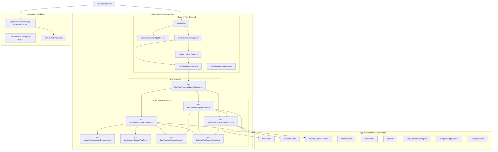
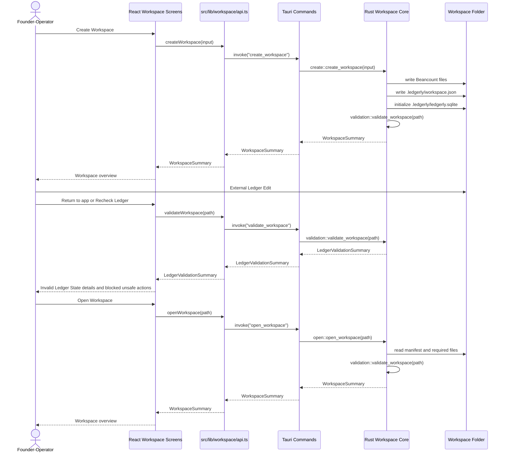
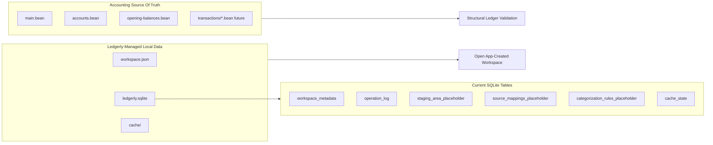
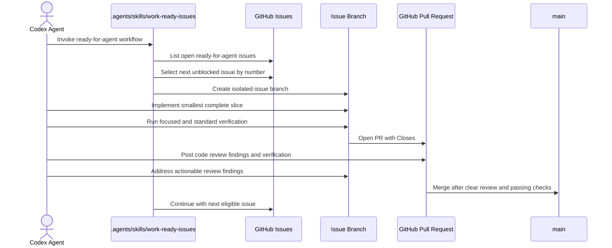

# Ledgerly Architecture

This document describes the current codebase architecture after the first App-Created Workspace lifecycle slice, the first Ledger Validation slice, and the local agent workflow skill used to work ready GitHub issues.

## Current System

## Runtime Flow

## Workspace Data Ownership

## Agent Issue Workflow

## Boundaries

- React owns presentation state, forms, error rendering, and Workspace overview screens.
- The Workspace overview renders Invalid Ledger State details from `WorkspaceSummary.ledgerValidation` and blocks unsafe Approval and MVP Report affordances while validation is invalid.
- `src/lib/workspace/api.ts` is the frontend boundary to native Workspace commands.
- Tauri commands translate frontend calls into Rust domain operations.
- `src-tauri/src/workspace/` owns Workspace filesystem layout, manifest handling, Beancount rendering, SQLite initialization, path validation, and structural ledger validation with file-aware error messages.
- The Workspace folder owns all accounting data needed for this slice. No Ledgerly cloud account is required.
- `.agents/skills/work-ready-issues/` owns the local AFK workflow for sequentially selecting, implementing, reviewing, merging, and continuing through GitHub issues labeled `ready-for-agent`.

## Current Constraints

- Only App-Created Workspaces are supported.
- `USD` is the only supported MVP currency.
- Validation is structural and local. It runs after Ledgerly creates a Workspace, when opening a Workspace, and when the UI rechecks the ledger after External Ledger Edits.
- The UI includes editable path fields so Workspace create/open works even when native directory picker support is unavailable in development.
- Tauri npm packages and Rust crates are pinned to the same `2.0.x` minor line to avoid dev-time version mismatch errors.
- Native Tauri dialog/opener plugin integration remains a future compatibility task.
