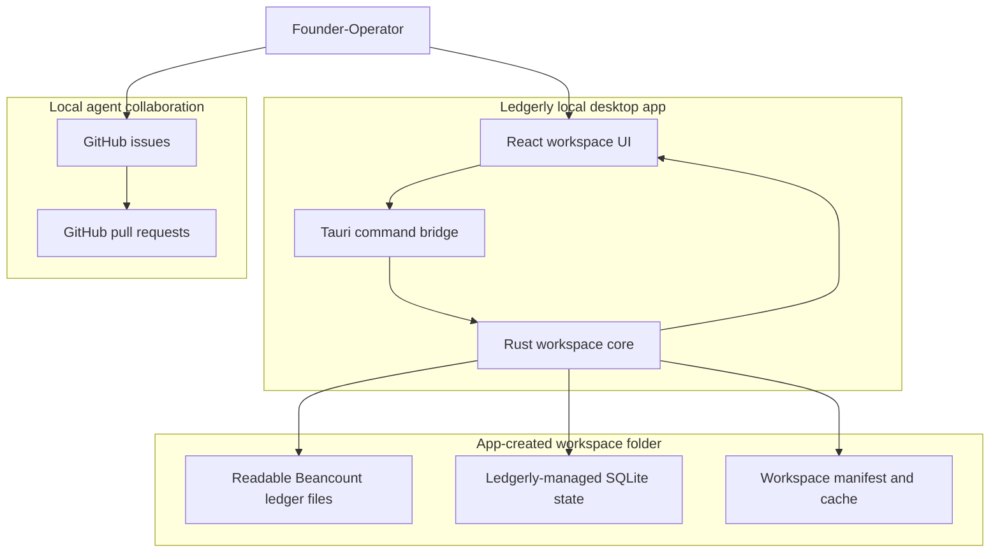
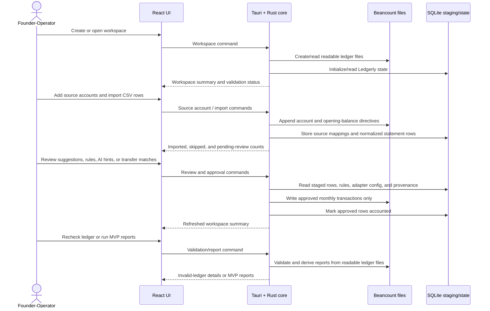
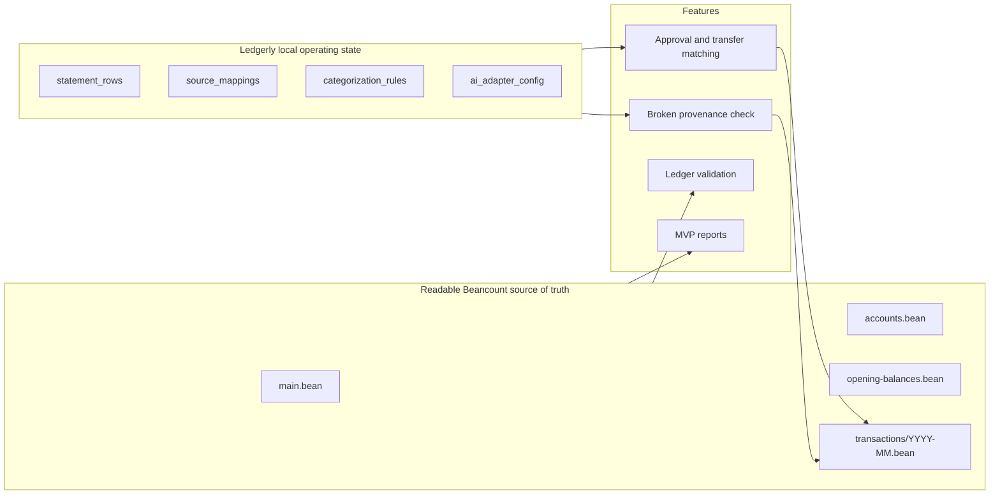
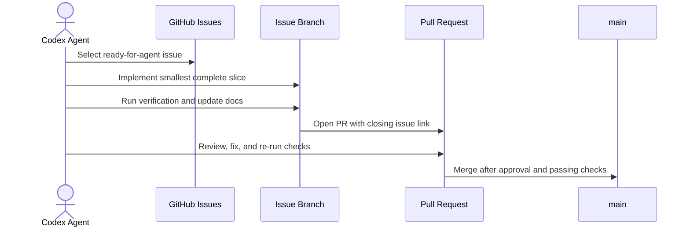

# Ledgerly Architecture

Ledgerly is a local-first desktop bookkeeping app. The diagrams below keep the human view small and readable while the surrounding tables preserve implementation detail for agents.

## Human-Readable System Map

## Product Runtime Flow

## Data Ownership Map

## Agent Issue Workflow

## Agent Detail Index

The simplified diagrams intentionally group files by responsibility. Use this index when an implementation task needs exact file paths.

| Area | Primary files | Responsibility |
| --- | --- | --- |
| React shell | `src/App.tsx`, `src/components/AppShell.tsx` | App composition, workspace route/state orchestration, and shared layout. |
| Workspace UI | `src/features/workspace/*` | Workspace create/open screens, invalid-ledger messaging, source-account setup, CSV import, AI adapter configuration, suggested-entry review, categorization rules, MVP reports, and broken-provenance display. |
| Frontend boundary | `src/lib/workspace/api.ts`, `src/lib/workspace/types.ts` | Typed calls from React into native Tauri workspace commands. |
| Tauri bridge | `src-tauri/src/commands/workspace.rs` | Command handlers that translate frontend requests into Rust workspace operations. |
| Rust workspace core | `src-tauri/src/workspace/create.rs`, `open.rs`, `validation.rs`, `source_accounts.rs`, `imports.rs`, `approval.rs`, `ai_adapter.rs`, `categorization_rules.rs`, `reports.rs` | Domain operations for workspace lifecycle, validation, source accounts, CSV staging, approval, AI suggestions, rules, transfer matching, provenance, and MVP reporting. |
| Core support | `src-tauri/src/workspace/beancount.rs`, `paths.rs`, `types.rs`, `errors.rs` | Beancount rendering/parsing helpers, workspace paths, shared DTOs, and error handling. |
| Golden path test | `src-tauri/src/workspace/golden_path_validation.rs` | End-to-end native workflow coverage from workspace creation through CSV import, approval, transfer approval, validation, provenance checks, invalid-ledger blocking, and MVP reports. |
| Local agent workflow | `.agents/skills/work-ready-issues/SKILL.md` | Sequential ready-for-agent issue selection, branch work, review, PR, merge, and continuation workflow. |

## Runtime Boundaries

- React owns presentation state, forms, error rendering, and Workspace overview screens.
- `src/lib/workspace/api.ts` is the frontend boundary to native Workspace commands.
- Tauri commands translate frontend calls into Rust domain operations.
- `src-tauri/src/workspace/` owns Workspace filesystem layout, manifest handling, Beancount rendering, SQLite initialization, path validation, Source Account ledger writes, CSV import staging, Source Mapping persistence, approval, AI adapter invocation, categorization rules, transfer matching, broken-provenance checks, MVP reporting, and structural ledger validation with file-aware error messages.
- The Workspace folder owns all accounting data needed for this slice. No Ledgerly cloud account is required.
- Readable Beancount files are the source of truth for ledger validation and MVP Reports.
- Ledgerly-managed SQLite state stores CSV staging rows, Source Mappings, Categorization Rules, BYO AI Adapter configuration, approval provenance, placeholders, and cache state.
- The Workspace overview renders Invalid Ledger State details from `WorkspaceSummary.ledgerValidation` and blocks unsafe Approval and MVP Report affordances while validation is invalid.
- Source Account setup appends valid Beancount directives to the readable ledger files rather than storing canonical account setup only in SQLite.
- CSV Import stores normalized Statement Rows in SQLite Staging Area tables without writing to Beancount.
- Import deduplication is scoped to `(source_account, import_fingerprint)` and skips duplicates even when prior rows are already accounted.
- Suggested Entry review reads pending Statement Rows, previews the Beancount entry, exposes Journal Detail, and approves non-transfer entries into Monthly Transaction Files.
- Categorization Rules are user-confirmed SQLite records scoped to Source Account by default, visible/editable in the Workspace overview, and used to prefill future Standard Suggested Entries before any AI suggestion layer.
- BYO AI Adapter configuration is optional SQLite state. When configured, Ledgerly sends Curated Ledger Context over stdin to the local adapter command and reads a structured AI Suggestion from stdout.
- Curated Ledger Context includes the Statement Row, Source Account, chart of accounts, Categorization Rules, similar approved entries, and business profile. It does not grant direct Workspace file access to the adapter.
- AI Suggestions can prefill review fields and expose confidence/explanation, but they never write to Beancount; Approval remains required.
- Transfer Matches are suggested from opposite-signed same-date Statement Rows across different Source Accounts, never auto-approved, and approved as one balanced Beancount Transfer Entry that marks both linked Statement Rows accounted.
- One-sided transfer hints can appear when a Statement Row description looks like a transfer or payment, but they do not claim another row or write an approval without a linked match.
- Approval retains each source Statement Row as accounted in the Staging Area, stores the Ledgerly entry id and ledger file path in SQLite, and writes minimal Beancount metadata for `ledgerly_entry_id`, `import_fingerprint`, `source_account`, and `source_file_name`.
- Broken Provenance is surfaced separately from structural Ledger Validation by scanning accounted Statement Rows against Ledgerly Entry Metadata in the readable ledger files.
- MVP Reports are derived from the readable Beancount ledger files, not from unapproved SQLite Staging Area rows. Reports currently parse Ledgerly-written opening balances and included Monthly Transaction Files to render Income Statement, Expense Breakdown, Source Account Balances, and a basic Balance Sheet.
- `.agents/skills/work-ready-issues/` owns the local AFK workflow for sequentially selecting, implementing, reviewing, merging, and continuing through GitHub issues labeled `ready-for-agent`.

## Current Constraints

- Only App-Created Workspaces are supported.
- `USD` is the only supported MVP currency.
- Validation is structural and local. It runs after Ledgerly creates a Workspace, when opening a Workspace, and when the UI rechecks the ledger after External Ledger Edits.
- The UI includes editable path fields so Workspace create/open works even when native directory picker support is unavailable in development.
- CSV Imports are tied to one Source Account. Imported Statement Rows live in SQLite Staging Area tables and do not mutate the Beancount ledger.
- Approval is blocked during Invalid Ledger State. Approved non-transfer entries write to `transactions/YYYY-MM.bean`, include a Source Account posting plus a balancing Ledger Account posting, and mark the Statement Row accounted in the Staging Area.
- Approved transfers write one transaction between the two Source Accounts and mark both linked Statement Rows accounted with the same Ledgerly entry id and ledger file path.
- MVP Reports are blocked during Invalid Ledger State and cover Ledgerly-written `.bean` syntax for the MVP reporting surface rather than arbitrary Beancount.
- Raw CSV row details, AI explanations, and confidence scores remain in Ledgerly-managed local data or transient review state and are not written as Beancount metadata.
- Tauri npm packages and Rust crates are pinned to the same `2.0.x` minor line to avoid dev-time version mismatch errors.
- Native Tauri dialog/opener plugin integration remains a future compatibility task.
