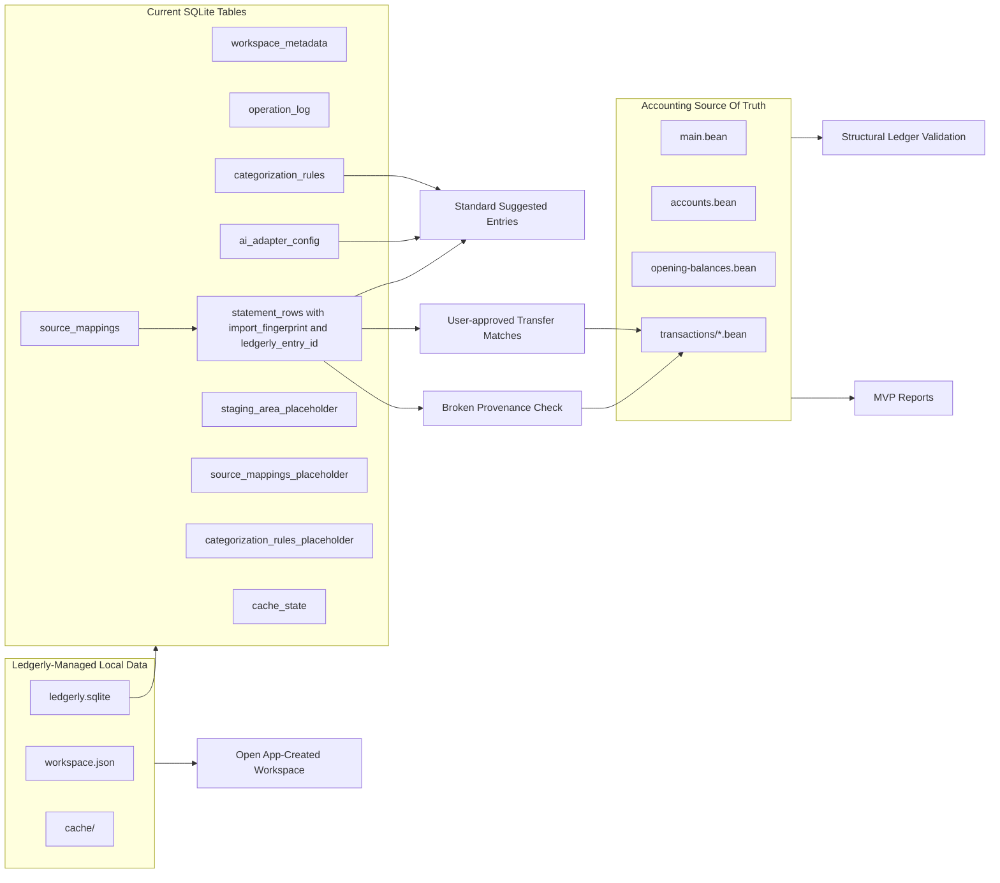
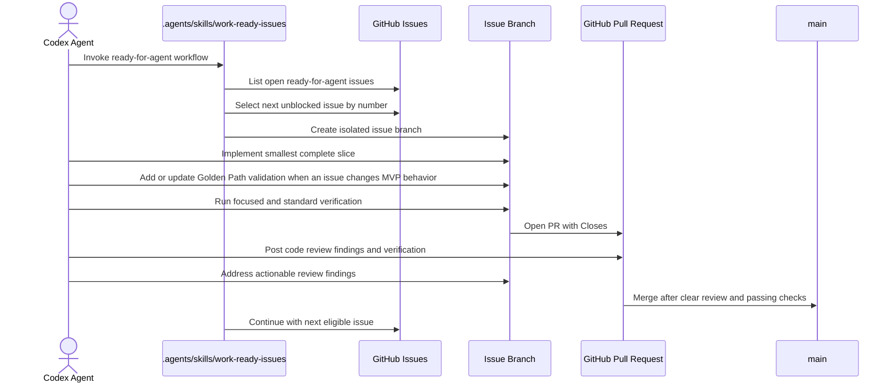

# Ledgerly Architecture

This document describes the current codebase architecture after the App-Created Workspace lifecycle, Ledger Validation, Source Account setup, CSV Staging Area, Approval, Categorization Rules, BYO AI Adapter, Transfer Match, Broken Provenance, MVP Reports, and local agent workflow slices.

## Current System

```mermaid
flowchart TB
  FounderOperator[Founder-Operator]

  subgraph DesktopApp[Ledgerly Local Desktop App]
    subgraph ReactUI[React + TypeScript UI]
      App[src/App.tsx]
      Shell[src/components/AppShell.tsx]
      WorkspaceScreens[src/features/workspace/*]
      WorkspaceApi[src/lib/workspace/api.ts]
      WorkspaceTypes[src/lib/workspace/types.ts]
      InvalidLedgerUI[Invalid Ledger State UI]
      SourceAccountSetup[src/features/workspace/SourceAccountSetup.tsx]
      CsvImportSetup[src/features/workspace/CsvImportSetup.tsx]
      AiAdapterPanel[src/features/workspace/AiAdapterPanel.tsx]
      SuggestedEntryReview[src/features/workspace/SuggestedEntryReview.tsx]
      CategorizationRulesPanel[src/features/workspace/CategorizationRulesPanel.tsx]
      MvpReportsPanel[src/features/workspace/MvpReportsPanel.tsx]
      BrokenProvenanceUI[Broken Provenance UI]
    end

    subgraph TauriRuntime[Tauri Runtime]
      Commands[src-tauri/src/commands/workspace.rs]
    end

    subgraph RustCore[Rust Workspace Core]
      GoldenPathValidation[src-tauri/src/workspace/golden_path_validation.rs test]
      Create[src-tauri/src/workspace/create.rs]
      Open[src-tauri/src/workspace/open.rs]
      Validation[src-tauri/src/workspace/validation.rs]
      SourceAccounts[src-tauri/src/workspace/source_accounts.rs]
      CsvImports[src-tauri/src/workspace/imports.rs]
      Approval[src-tauri/src/workspace/approval.rs]
      AiAdapter[src-tauri/src/workspace/ai_adapter.rs]
      CategorizationRules[src-tauri/src/workspace/categorization_rules.rs]
      Reports[src-tauri/src/workspace/reports.rs]
      Beancount[src-tauri/src/workspace/beancount.rs]
      Paths[src-tauri/src/workspace/paths.rs]
      Types[src-tauri/src/workspace/types.rs]
      Errors[src-tauri/src/workspace/errors.rs]
    end
  end

  subgraph WorkspaceFolder[App-Created Workspace Folder]
    MainBean[main.bean]
    AccountsBean[accounts.bean]
    OpeningBalances[opening-balances.bean]
    Transactions[transactions/]
    Documents[documents/]
    Imports[imports/]
    Manifest[.ledgerly/workspace.json]
    Sqlite[.ledgerly/ledgerly.sqlite]
    Cache[.ledgerly/cache/]
  end

  subgraph AgentWorkflow[Local Agent Workflow]
    WorkReadySkill[.agents/skills/work-ready-issues/SKILL.md]
    GitHubIssues[GitHub Issues: ready-for-agent]
    GitHubPRs[GitHub Pull Requests]
  end

  FounderOperator --> App
  FounderOperator --> WorkReadySkill
  App --> Shell
  App --> WorkspaceScreens
  WorkspaceScreens --> WorkspaceApi
  WorkspaceScreens --> InvalidLedgerUI
  WorkspaceScreens --> SourceAccountSetup
  WorkspaceScreens --> CsvImportSetup
  WorkspaceScreens --> AiAdapterPanel
  WorkspaceScreens --> SuggestedEntryReview
  WorkspaceScreens --> CategorizationRulesPanel
  WorkspaceScreens --> MvpReportsPanel
  WorkspaceScreens --> BrokenProvenanceUI
  WorkspaceApi --> Commands
  Commands --> Create
  Commands --> Open
  Commands --> Validation
  Commands --> SourceAccounts
  Commands --> CsvImports
  Commands --> Approval
  Commands --> AiAdapter
  Commands --> CategorizationRules
  Commands --> Reports
  GoldenPathValidation --> Create
  GoldenPathValidation --> SourceAccounts
  GoldenPathValidation --> CsvImports
  GoldenPathValidation --> Approval
  GoldenPathValidation --> Validation
  GoldenPathValidation --> Reports
  Create --> Beancount
  Create --> Paths
  Create --> Types
  Create --> Errors
  Open --> Validation
  SourceAccounts --> Open
  SourceAccounts --> Validation
  CsvImports --> Types
  Approval --> Validation
  Approval --> Open
  Approval --> Sqlite
  Approval --> AiAdapter
  Approval --> CategorizationRules
  Open --> Types
  Open --> Errors
  Validation --> Errors
  Create --> WorkspaceFolder
  Open --> WorkspaceFolder
  Validation --> MainBean
  Validation --> AccountsBean
  Validation --> OpeningBalances
  InvalidLedgerUI --> WorkspaceApi
  SourceAccountSetup --> WorkspaceApi
  CsvImportSetup --> WorkspaceApi
  AiAdapterPanel --> WorkspaceApi
  SuggestedEntryReview --> WorkspaceApi
  CategorizationRulesPanel --> WorkspaceApi
  MvpReportsPanel --> WorkspaceApi
  SourceAccounts --> AccountsBean
  SourceAccounts --> OpeningBalances
  CsvImports --> Sqlite
  Approval --> Transactions
  Approval --> Sqlite
  AiAdapter --> Sqlite
  BrokenProvenanceUI --> WorkspaceApi
  Reports --> Validation
  Reports --> MainBean
  Reports --> OpeningBalances
  Reports --> Transactions
  WorkReadySkill --> GitHubIssues
  WorkReadySkill --> GitHubPRs
```

## Runtime Flow

```mermaid
sequenceDiagram
  actor User as Founder-Operator
  participant UI as React Workspace Screens
  participant API as src/lib/workspace/api.ts
  participant Cmd as Tauri Commands
  participant Core as Rust Workspace Core
  participant Disk as Workspace Folder

  User->>UI: Create Workspace
  UI->>API: createWorkspace(input)
  API->>Cmd: invoke("create_workspace")
  Cmd->>Core: create::create_workspace(input)
  Core->>Disk: write Beancount files
  Core->>Disk: write .ledgerly/workspace.json
  Core->>Disk: initialize .ledgerly/ledgerly.sqlite
  Core->>Core: validation::validate_workspace(path)
  Core-->>Cmd: WorkspaceSummary
  Cmd-->>API: WorkspaceSummary
  API-->>UI: WorkspaceSummary
  UI-->>User: Workspace overview

  User->>Disk: External Ledger Edit
  User->>UI: Return to app or Recheck Ledger
  UI->>API: validateWorkspace(path)
  API->>Cmd: invoke("validate_workspace")
  Cmd->>Core: validation::validate_workspace(path)
  Core-->>Cmd: LedgerValidationSummary
  Cmd-->>API: LedgerValidationSummary
  API-->>UI: LedgerValidationSummary
  UI-->>User: Invalid Ledger State details and blocked unsafe actions

  User->>UI: Add Source Account
  UI->>API: addSourceAccount(input)
  API->>Cmd: invoke("add_source_account")
  Cmd->>Core: source_accounts::add_source_account(input)
  Core->>Disk: append account open directive
  Core->>Disk: append optional opening balance directive
  Core->>Core: open::open_workspace(path)
  Core-->>Cmd: WorkspaceSummary
  Cmd-->>API: WorkspaceSummary
  API-->>UI: WorkspaceSummary
  UI-->>User: Refreshed Workspace overview

  User->>UI: Import CSV Statement Rows
  UI->>API: importStatementRows(input)
  API->>Cmd: invoke("import_statement_rows")
  Cmd->>Core: imports::import_statement_rows(input)
  Core->>Disk: save Source Mapping in SQLite
  Core->>Disk: store normalized Statement Rows in Staging Area
  Core-->>Cmd: CsvImportResult
  Cmd-->>API: CsvImportResult
  API-->>UI: CsvImportResult
  UI-->>User: CSV import complete with imported and skipped counts

  User->>UI: Review Suggested Entry or Transfer Match
  UI->>API: getSuggestedEntries(path)
  API->>Cmd: invoke("get_suggested_entries")
  Cmd->>Core: approval::get_suggested_entries(path)
  Core->>Disk: apply matching Categorization Rules from SQLite
  Core->>Core: invoke configured BYO AI Adapter with Curated Ledger Context
  Core-->>UI: Standard Suggested Entries, rule/AI suggestions, and explicit Transfer Matches
  User->>UI: Approve Entry
  UI->>API: approveSuggestedEntry(input)
  API->>Cmd: invoke("approve_suggested_entry")
  Cmd->>Core: approval::approve_suggested_entry(input)
  Core->>Core: validation::validate_workspace(path)
  Core->>Disk: append Monthly Transaction File entry
  Core->>Disk: write Ledgerly Entry Metadata
  Core->>Disk: ensure main.bean includes month file
  Core->>Disk: mark Statement Row accounted with approved entry id and file
  Core-->>UI: Refreshed Workspace summary

  UI->>User: Offer Categorization Rule
  User->>UI: Confirm Create Rule
  UI->>API: createCategorizationRule(input)
  API->>Cmd: invoke("create_categorization_rule")
  Cmd->>Core: categorization_rules::create_categorization_rule(input)
  Core->>Disk: persist source-scoped rule in SQLite
  Core-->>UI: Confirmed Categorization Rule

  User->>UI: Configure BYO AI Adapter
  UI->>API: configureAiAdapter(input)
  API->>Cmd: invoke("configure_ai_adapter")
  Cmd->>Core: ai_adapter::configure_ai_adapter(input)
  Core->>Disk: persist optional local adapter command in SQLite
  UI->>API: getAiContextDisclosure(path)
  API->>Cmd: invoke("get_ai_context_disclosure")
  Cmd->>Core: ai_adapter::get_ai_context_disclosure(path)
  Core-->>UI: AI Context Disclosure fields

  User->>UI: Approve Transfer
  UI->>API: approveTransferEntry(input)
  API->>Cmd: invoke("approve_transfer_entry")
  Cmd->>Core: approval::approve_transfer_entry(input)
  Core->>Core: validate opposite Source Account rows
  Core->>Disk: append one balanced Transfer Entry
  Core->>Disk: mark both Statement Rows accounted
  Core-->>UI: Refreshed Workspace summary

  UI->>API: getBrokenProvenance(path)
  API->>Cmd: invoke("get_broken_provenance")
  Cmd->>Core: approval::get_broken_provenance(path)
  Core->>Disk: scan accounted Statement Rows and Ledgerly Entry Metadata
  Core-->>UI: Broken Provenance rows without changing Ledger Validation status

  User->>UI: Run MVP Reports for Period
  UI->>API: getMvpReports(input)
  API->>Cmd: invoke("get_mvp_reports")
  Cmd->>Core: reports::get_mvp_reports(input)
  Core->>Core: validation::validate_workspace(path)
  Core->>Disk: read opening balances and included Monthly Transaction Files
  Core-->>UI: Income Statement, Expense Breakdown, Source Balances, Balance Sheet

  User->>UI: Open Workspace
  UI->>API: openWorkspace(path)
  API->>Cmd: invoke("open_workspace")
  Cmd->>Core: open::open_workspace(path)
  Core->>Disk: read manifest and required files
  Core->>Core: validation::validate_workspace(path)
  Core-->>Cmd: WorkspaceSummary
  Cmd-->>API: WorkspaceSummary
  API-->>UI: WorkspaceSummary
  UI-->>User: Workspace overview
```

## Workspace Data Ownership

## Agent Issue Workflow

## Boundaries

- React owns presentation state, forms, error rendering, and Workspace overview screens.
- The Workspace overview renders Invalid Ledger State details from `WorkspaceSummary.ledgerValidation` and blocks unsafe Approval and MVP Report affordances while validation is invalid.
- The Source Account setup UI collects bank or credit-card Source Accounts and optional Opening Balances, then refreshes the Workspace summary returned from the native write.
- The CSV Import setup UI collects a Source Account, raw CSV contents, and a Source Mapping, then stores normalized Statement Rows in SQLite Staging Area tables without writing to Beancount.
- CSV Import computes an Import Fingerprint from normalized row identity, scopes deduplication to the Source Account, and skips duplicates even when prior rows are already accounted.
- Suggested Entry review reads pending Statement Rows, previews the Beancount entry, exposes Journal Detail, and approves non-transfer entries into Monthly Transaction Files.
- Categorization Rules are user-confirmed SQLite records scoped to Source Account by default, visible/editable in the Workspace overview, and used to prefill future Standard Suggested Entries before any future AI suggestion layer.
- Approval can offer a Categorization Rule after a non-transfer entry is approved, but the rule is not created until the Founder-Operator confirms it.
- BYO AI Adapter configuration is optional SQLite state. When configured, Ledgerly sends Curated Ledger Context over stdin to the local adapter command and reads a structured AI Suggestion from stdout.
- Curated Ledger Context includes the Statement Row, Source Account, chart of accounts, Categorization Rules, similar approved entries, and business profile. It does not grant direct Workspace file access to the adapter.
- AI Suggestions can prefill review fields and expose confidence/explanation, but they never write to Beancount; Approval remains required.
- Transfer Matches are suggested from opposite-signed same-date Statement Rows across different Source Accounts, never auto-approved, and approved as one balanced Beancount Transfer Entry that marks both linked Statement Rows accounted.
- One-sided transfer hints can appear when a Statement Row description looks like a transfer or payment, but they do not claim another row or write an approval without a linked match.
- Approval retains each source Statement Row as accounted in the Staging Area, stores the Ledgerly entry id and ledger file path in SQLite, and writes minimal Beancount metadata for `ledgerly_entry_id`, `import_fingerprint`, `source_account`, and `source_file_name`.
- Broken Provenance is surfaced separately from structural Ledger Validation by scanning accounted Statement Rows against Ledgerly Entry Metadata in the readable ledger files.
- MVP Reports are derived from the readable Beancount ledger files, not from unapproved SQLite Staging Area rows. Reports currently parse Ledgerly-written opening balances and included Monthly Transaction Files to render Income Statement, Expense Breakdown, Source Account Balances, and a basic Balance Sheet.
- The Golden Path validation test exercises the native workflow from App-Created Workspace setup through CSV import, Approval, Transfer Match approval, Ledger Validation, Staging Area provenance, invalid-ledger blocking, and MVP Reports.
- `src/lib/workspace/api.ts` is the frontend boundary to native Workspace commands.
- Tauri commands translate frontend calls into Rust domain operations.
- `src-tauri/src/workspace/` owns Workspace filesystem layout, manifest handling, Beancount rendering, SQLite initialization, path validation, Source Account ledger writes, CSV import staging, Source Mapping persistence, and structural ledger validation with file-aware error messages.
- The Workspace folder owns all accounting data needed for this slice. No Ledgerly cloud account is required.
- `.agents/skills/work-ready-issues/` owns the local AFK workflow for sequentially selecting, implementing, reviewing, merging, and continuing through GitHub issues labeled `ready-for-agent`.

## Current Constraints

- Only App-Created Workspaces are supported.
- `USD` is the only supported MVP currency.
- Validation is structural and local. It runs after Ledgerly creates a Workspace, when opening a Workspace, and when the UI rechecks the ledger after External Ledger Edits.
- The UI includes editable path fields so Workspace create/open works even when native directory picker support is unavailable in development.
- Source Account setup appends valid Beancount directives to the readable ledger files rather than storing canonical account setup only in SQLite.
- CSV Imports are tied to one Source Account. Imported Statement Rows live in SQLite Staging Area tables and do not mutate the Beancount ledger.
- Import deduplication is scoped to `(source_account, import_fingerprint)` and does not attempt global duplicate ledger detection.
- Approval is blocked during Invalid Ledger State. Approved non-transfer entries write to `transactions/YYYY-MM.bean`, include a Source Account posting plus a balancing Ledger Account posting, and mark the Statement Row accounted in the Staging Area.
- Approved transfers write one transaction between the two Source Accounts and mark both linked Statement Rows accounted with the same Ledgerly entry id and ledger file path.
- MVP Reports are blocked during Invalid Ledger State and cover Ledgerly-written `.bean` syntax for the MVP reporting surface rather than arbitrary Beancount.
- Raw CSV row details, AI explanations, and confidence scores remain in Ledgerly-managed local data or transient review state and are not written as Beancount metadata.
- Tauri npm packages and Rust crates are pinned to the same `2.0.x` minor line to avoid dev-time version mismatch errors.
- Native Tauri dialog/opener plugin integration remains a future compatibility task.
